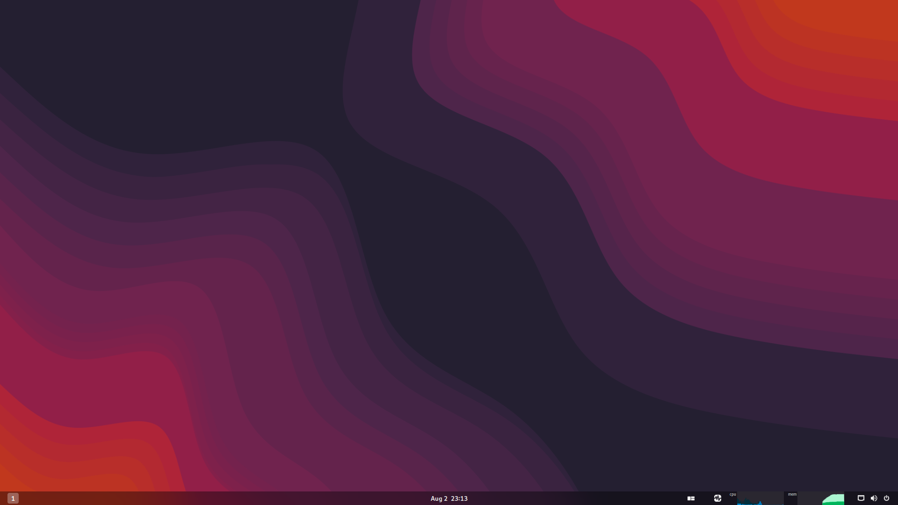

# Lazuli
## A blingy, opinionated GNOME with an i3 feel
> **Warning**
> This image is still in development and may rapidly change, you have been warned!

[](https://github.com/jerbmega/lazuli/actions/workflows/build.yml)



Lazuli is an OCI container image built off of [Universal Blue](https://universal-blue.org) that brings an opinionated, tiled set of defaults to the GNOME desktop environment. Its intent is to provide a middle ground between the keyboard-centric workflow of a tiling window manager, and the integration of a full-fledged desktop environment. By utilizing Pop Shell and custom keybinds, the goal is to feel close to home for an i3 or Sway user without sacrificing on bling or features.

## Why?

We are in the middle of a paradigm shift when it comes to Linux application distribution and the userspace application security model. Increasingly, apps are transitioning from an "all or nothing" permission model to a much more selective model reminiscent of a typical iOS or Android device. Without extra configuration, a tiling window manager alone cannot support these new paradigms. Many work, such as the file chooser portal, but not all do!

A good example of this is the EasyEffects Flatpak, which requires special permissions to run in the background. On my old i3 setup, EasyEffects did *not* support this behavior. Even when installing GNOME's portal implementation and manually enabling background support in Flatseal, this doesn't work! On GNOME this works out of the box and needs no further hassle.

We are *also* in the middle of a slow but steady transition from the antiquated X11 display server to Wayland. XWayland Video Bridge, designed purely to appease apps still stuck on X11 and not using PipeWire as their video capture mechanism, works properly on KDE and GNOME but, last I checked, has issues on Sway. That's a big downside if end-users rely on Discord or Teams or another proprietary app that will likely never adopt the new model. I hear it works on Hyprland but Hyprland won't solve the Flatpak permission problem.

One could simply run GNOME as the DE and replace Mutter with i3... on X11. Wayland environments are fully separate compositors, and it is not possible to run GNOME but with Sway as a backend instead of Mutter. If such a thing existed, it would almost certainly be a "here be dragons" affair. I rely on my computer too much for that!

To me, taking a standard DE and augmenting it to my usual workflow feels like the way forward, and this image is the result of my experiments in bringing this concept to fruition. Unlike my old image, which was solely a personal image, I've done my best to ensure that defaults aren't *too* tailored to my personal needs. I recognize that I'm likely not the only one in this boat, after all- the image is opinionated but I'd like this to be close to a general replacement.

## Details
### Main changes
* Pop Shell, Blur My Shell, Just Perfection, GSConnect, AppIndicator and Space Bar shell extensions installed out of the box
* Top bar moved to the bottom to emulate a default i3 or Sway setup
* Ten static workspaces set up out of the box, with Space Bar configured to hide empty workspaces
* Pop Shell configured to have key bindings similar to (but *not* identical to) i3/Sway
* Active window set to whatever the mouse is hovered over like in i3/Sway
* Distrobox configured as the default terminal experience on `Super+Enter`
  - `distrobox-assemble` is configured to automatically build the contents of `$HOME/.config/ublue/boxkit.ini` on login. If not present, the default `/usr/share/ublue-os/boxkit.ini` will be used instead
  - The default config builds a Fedora distrobox with the following commands transparently passed to the host:
    * docker-compose
    * podman-compose
    * flatpak
    * podman
    * rpm-ostree
    * systemctl
    * distrobox
    * tailscale
    * updatedb
    * locate
    * firewall-cmd
* Standard terminal mapped to `Super+Shift+Enter`

### VRR support
An image with variable refresh rate and fractional scaling support is available under `lazuli-vrr` & `lazuli-nvidia-vrr`.

> **Warning**
> The `lazuli-vrr` and `lazuli-nvidia-vrr` images use an unofficial fork of Mutter and other GNOME components *not supported* by GNOME upstream yet. Make sure bugs are reproduceable on vanilla Lazuli as well before submitting bug reports to GNOME!

### Niceties
* All of the QoL features from upstream Universal Blue (Media codecs installed, OBS loopback and extra hardware-enablement kmods shipped out of the box)
* Tailscale installed and default-enabled
* Adw-gtk3 configured as the default GTK3 theme
  - This will also make GTK3 Flatpak apps respect GNOME's light or dark theme setting and blend in with the rest of the environment seamlessly
* GVFS support for SMB and MTP

### Hardware enablement
* `apcupsd`, to facilitate monitoring and additional features of supported APC uninterruptable power supplies
* `ckb-next` installed (included service default-disabled) to control features of Corsair peripherals, particularly RGB

## Installation

> **Warning**
> [This is an experimental feature](https://www.fedoraproject.org/wiki/Changes/OstreeNativeContainerStable) and should not be used in production, try it in a VM for a while!

ISO's are provided under Releases that will install Lazuli with no further hassle.

To rebase an existing Silverblue/Kinoite installation to the latest build:

- First rebase to the unsigned image, to get the proper signing keys and policies installed:
  ```
  sudo rpm-ostree rebase ostree-unverified-registry:ghcr.io/jerbmega/lazuli:latest
  ```
- Reboot to complete the rebase:
  ```
  systemctl reboot
  ```
- Then rebase to the signed image, like so:
  ```
  sudo rpm-ostree rebase ostree-image-signed:docker://ghcr.io/jerbmega/lazuli:latest
  ```
- Reboot again to complete the installation
  ```
  systemctl reboot
  ```

This repository builds date tags as well, so if you want to rebase to a particular day's build:

```
sudo rpm-ostree rebase ostree-image-signed:docker://ghcr.io/jerbmega/lazuli:20230403
```
